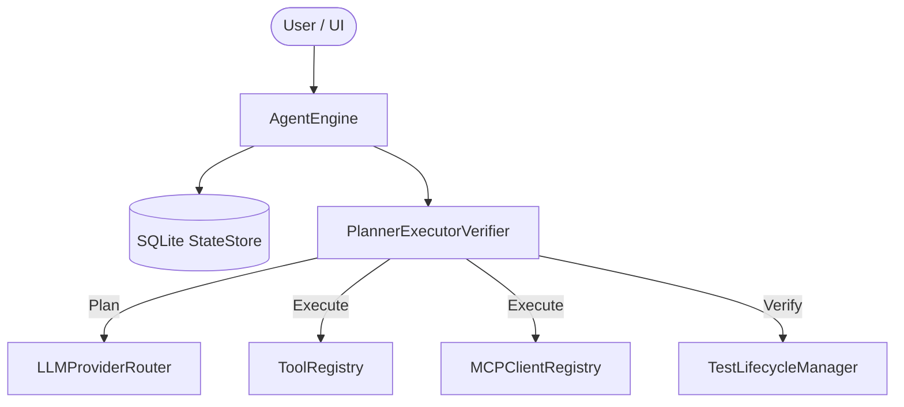

# 🤖 Local AI Agent System

Welcome to the **Local AI Agent System**! This is a powerful, local-first, autonomous AI agent orchestrator designed to plan, execute, and verify tasks using a flexible three-phase loop. The system connects to local LLM providers (LM Studio or Ollama), features an interactive FastAPI web UI, and implements Model Context Protocol (MCP) for tool integrations.

---

## 🏗️ Architecture & Core Components

The app is built with a modular 4-layer architecture. Here are the core components that power the agent:

### 1. `AgentEngine` (`agent/engine.py`)
The top-level orchestrator. It wires together all the subsystems (database, orchestrator, tools, UI) and manages the overarching lifecycle of tasks and runs.

### 2. `PlannerExecutorVerifier` (`agent/orchestrator.py`)
The heart of the autonomous loop. It implements a rigorous three-phase cycle:
- **Plan (`._plan`)**: Breaks down the user's goal into a structured sequence of `TaskStep`s.
- **Execute (`._execute`)**: Executes the steps sequentially, choosing appropriate tools.
- **Verify (`._verify`)**: Validates the outcome of each execution to ensure it meets the required goal, running automated tests via the `TestLifecycleManager`.

### 3. `StateStore` (`agent/store.py`)
A robust SQLite-backed persistence layer. It stores all agent state, including run history, steps, tests, approvals, and messages. This allows runs to be paused, resumed, or recovered gracefully.

### 4. `MCPClientRegistry` (`agent/mcp_client.py`)
Manages dynamic connections to external Model Context Protocol (MCP) servers, allowing the agent to extend its capabilities seamlessly without hardcoded tool integrations.

### 5. `ToolRegistry` (`agent/tools.py`)
Handles dynamic tool registration and execution. It enforces security policies, such as the human approval workflow for sensitive operations (e.g., shell command execution).

### 6. `LLMProviderRouter` & `LocalLLMClient` (`agent/llm_client.py`)
A flexible LLM abstraction layer that routes requests to local providers like LM Studio or Ollama, configured via `AgentConfig` (`config.yaml`).



---

## 📚 Technical Documentation

To explore the agent framework in depth, check out the following documentation files:

*   **[Extending the AI Agent Framework (EXTENSION_GUIDE.md)](file:///Users/suren/Hobby/AI_Agent/EXTENSION_GUIDE.md)**: A developer-centric guide detailing how to add new UI features, FastAPI backend routes, built-in/custom tools, or modify the core planning loop.
*   **[Implementation Blueprint (LM_STUDIO_AGENT_MCP_FOOLPROOF_PLAN.md)](file:///Users/suren/Hobby/AI_Agent/LM_STUDIO_AGENT_MCP_FOOLPROOF_PLAN.md)**: The foundational implementation roadmap defining database schemas, safety rules, prompt contracts, and local LLM configurations.
*   **[Completeness Analysis (agent_completeness_analysis.md)](file:///Users/suren/Hobby/AI_Agent/agent_completeness_analysis.md)**: A detailed audit showing implemented vs. missing/skeletal features, known limits, and priority gaps.

---

## 🚀 Installation & Setup

You can install and run the AI Agent System either by cloning the repository for development or running a built application package.

### Option 1: Code Cloning (From Source)

This is the recommended approach for developers who want to modify the agent or add new tools.

1. **Clone the repository:**
   ```bash
   git clone https://github.com/yourusername/AI_Agent.git
   cd AI_Agent
   ```

2. **Set up a Python Virtual Environment:**
   ```bash
   python3 -m venv .venv
   source .venv/bin/activate  # On Windows: .venv\Scripts\activate
   ```

3. **Install Dependencies:**
   ```bash
   pip install -r requirements.txt
   ```

4. **Run the Agent:**
   ```bash
   python agent.py
   ```
   *The system will automatically generate a default `config.yaml` on the first run.*

### Option 2: Built Apps (Standalone)

If you are a user looking to just run the agent without modifying code, you can use the built standalone versions (once released).

1. **Download the Release:**
   Navigate to the **Releases** tab on the GitHub repository and download the appropriate binary for your OS (Windows `.exe`, macOS `.app`, or Linux executable).
2. **Execute:**
   Double-click the application to launch the built-in UI and background engine. It will automatically bundle its own Python environment.
3. **Configure LLM:**
   In the UI settings, point the agent to your local instance of LM Studio or Ollama.

---

## 🧪 Testing Suite & Test Breakdown

The test suite has been modularized from a single monolithic file into individual test files focused on different aspects of the system. 

### Test Structure

*   **[tests/test_config.py](file:///Users/suren/Hobby/AI_Agent/tests/test_config.py)**: Verifies YAML configuration parsing and switching between LM Studio/Ollama runtime targets.
*   **[tests/test_lifecycle.py](file:///Users/suren/Hobby/AI_Agent/tests/test_lifecycle.py)**: Tests the test lifecycle manager, test deletion behaviors, and test-gate validation.
*   **[tests/test_tools_safety.py](file:///Users/suren/Hobby/AI_Agent/tests/test_tools_safety.py)**: Validates command allowlisting, shell blocklists, path jail boundaries, custom Python tool discovery, and approval decisions.
*   **[tests/test_mcp.py](file:///Users/suren/Hobby/AI_Agent/tests/test_mcp.py)**: Exercises stdio-based MCP client registration and server connection testing.
*   **[tests/test_skills.py](file:///Users/suren/Hobby/AI_Agent/tests/test_skills.py)**: Tests scanning of folder-based skill instructions (`SKILL.md`).
*   **[tests/test_ui.py](file:///Users/suren/Hobby/AI_Agent/tests/test_ui.py)**: Tests all endpoints exposed by the FastAPI application (e.g. settings updates, runs, approvals, and custom tools endpoints).
*   **[tests/test_orchestrator.py](file:///Users/suren/Hobby/AI_Agent/tests/test_orchestrator.py)**: Tests the main Planner-Executor-Verifier autonomous loop, persistence of history in SQLite, and integration goals.
*   **[tests/test_all.py](file:///Users/suren/Hobby/AI_Agent/tests/test_all.py)**: The master entry point that connects the entire suite together for programmatic execution.

### How to Run the Tests

Make sure your virtual environment is active before running tests.

*   **Run the entire test suite:**
    ```bash
    pytest
    ```
*   **Run a specific test aspect (e.g., Safety & Tools):**
    ```bash
    pytest tests/test_tools_safety.py
    ```
*   **Run programmatically via the master entry point:**
    ```bash
    python tests/test_all.py
    ```

---

## 🛠️ Configuration

Configuration is managed via `config.yaml` (automatically generated on first run). 

- **LLM Settings:** Switch between `lm_studio` or `ollama`.
- **Safety Policies:** Configure what tools require explicit human approval via the UI before execution.
- **MCP Servers:** Define paths or endpoints to dynamically load MCP extensions.

---

*Documentation generated with the assistance of [graphify](https://github.com/safishamsi/graphify).*
